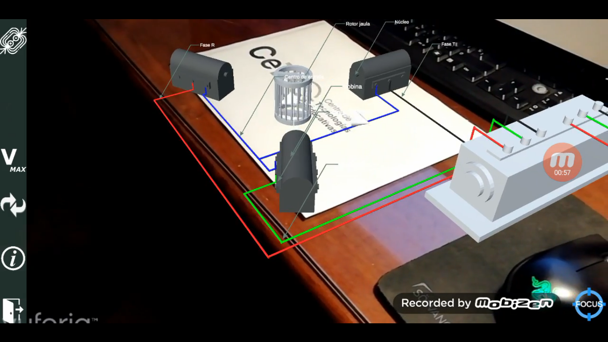
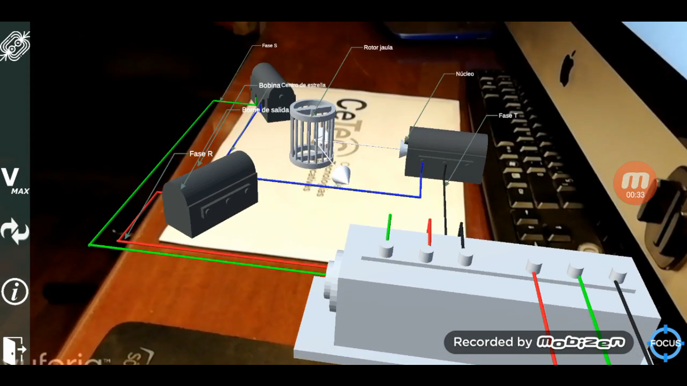
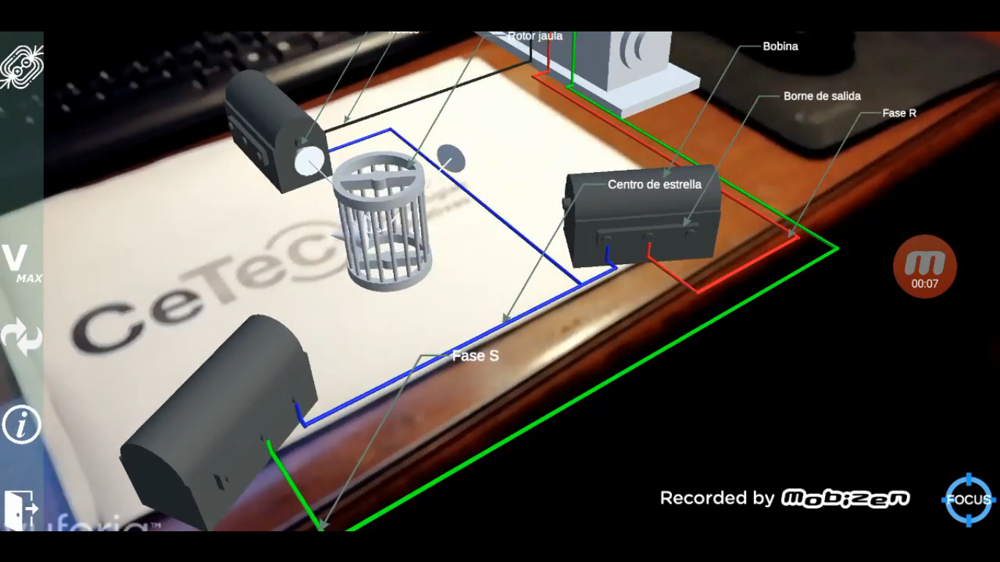
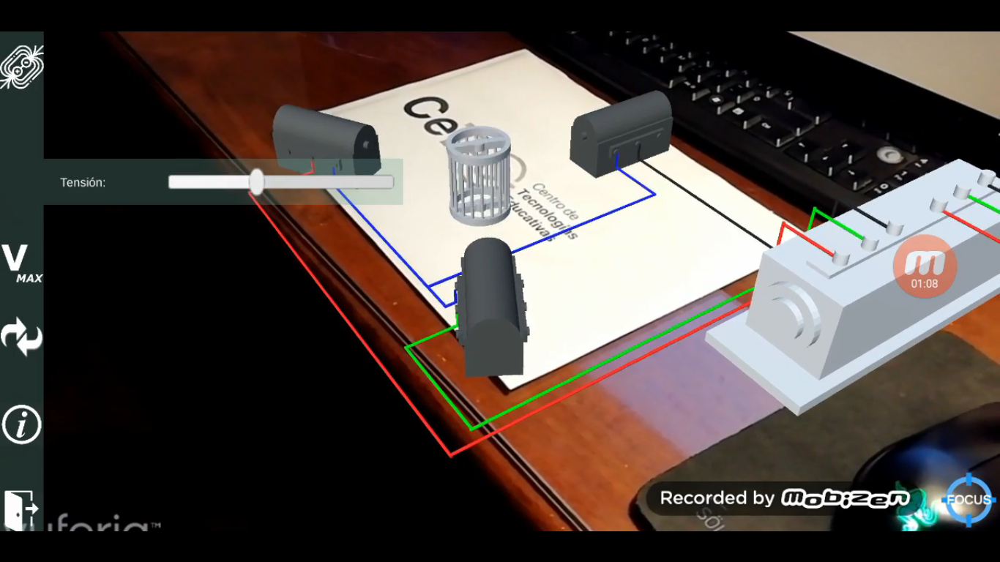

# Electrotecnia

## Introducción

El proyecto de electrotecnia consiste en la visualización gráfica mediante realidad aumentada del experimento de generación de un campo magnético rotante mediante tres bobinas conectadas a un transformador que les provee de una corriente asincrónica trifásica.

## Manual de usuario

La funcionalidad de esta aplicación consiste en mostrar sobre una hoja impresa con el logo del CEAD una recreación del experimento. Este experimento consiste en la aparición de 3 bobinas ubicadas a una distancia equidistante, orientadas hacia un punto central.

Cada una de las bobinas está conectada mediante un cable a un transformador. Cada uno de esos cables representa una fase y están representados por diferentes colores.

En el centro de la escena se ubica la jaula rotante, que gira sobre su eje motivada por el campo magnético rotante generado por las 3 bobinas.

Para visualizar éste campo magnético, se muestra para cada bobina el vector del campo magnético que generan individualmente. Dado que cada bobina está conectada a una fuente (que no se representa, se representa sólamente el transformador) que le proporciona una corriente alterna, la amplitud del campo magnético resultante obedece a una función senoidal, de modo tal que este patrón es el que se ve reflejado en la variación de la longitud del vector campo magnético individual.

El movimiento conjunto de los vectores permite visualizar el campo magnético resultante, que es un campo magnético rotante. El movimiento de la jaula sobre su propio eje es provocado por este campo.
De esta forma podemos visualizar gráficamente el concepto abstracto que hay detrás del principio de funcionamiento de un motor asincrónico trifásico.

Además de estas funcionalidades, se agregó indicadores para mostrar al usuario el nombre de cada uno de los objetos u otros elementos del experimento para los que sea de interés identificarlos por un nombre.

Si están activados, estos indicadores se van orientando en todo momento hacia el usuario, para que no dependa de la posición de éste y sea fácil de visualizar.

En cuanto a la interfaz, se provee de varias opciones al usuario:

**Botón de información:**

Permite activar y desactivar los indicadores

**Botón y slider de tensión:**

Permite incrementar o reducir la tensión, resultando en la aceleración o desaceleración de la rotación del campo magnético.

**Botón de reversibilidad del campo magnético:**

Para revertir el campo magnético. Al presionarlo se notará que se intercambiaron las fases de dos bobinas.

**Botón de campo magnético:**

Activa o desactiva los vectores de campo magnético.
